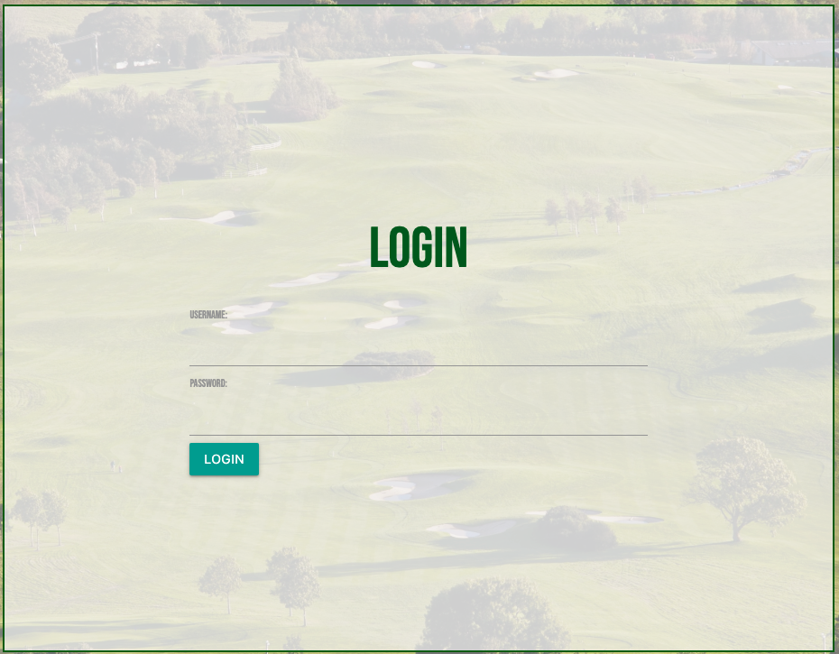
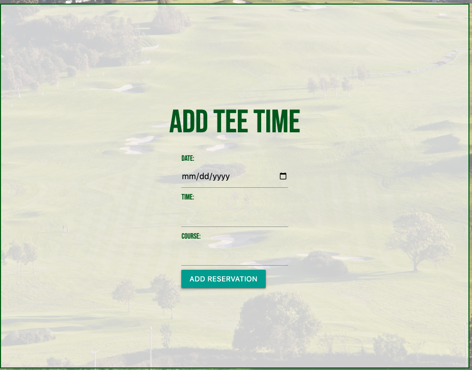
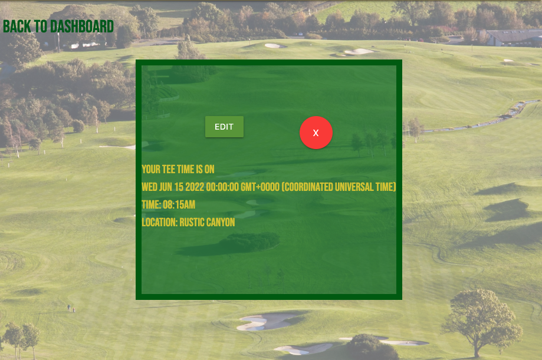
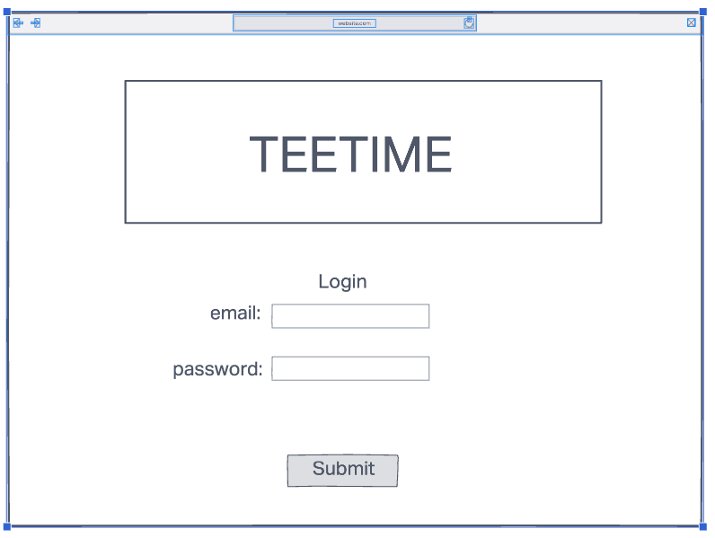
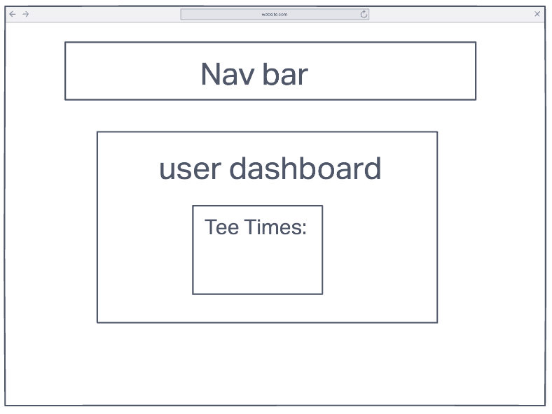

# TeeTime

#### A full-stack CRUD application 

## Description
TeeTime: A full CRUD web application that allows users to add and track tee time reservations. 

## Table of Contents
* [Technologies Used](#technologiesused)
* [Features](#features)
* [Design](#design)
* [Project Next Steps](#nextsteps)
* [Deployed App](#deployment)
* [About the Author](#author)

## Technologies Used
* JavaScript
* HTML5
* CSS3
* Node.js
* Express.js
* MongoDb
* Mongoose 
* Materialize 

## Features
Users are able to create, view, edit, and delete their tee time reservations. 

## Whiteboard Images

## Trello Planning
*https://trello.com/b/DUSQgM21/teetime

## Design
* Design elements implemented using HTML5 and CSS3 along with Materialize 1.0.0 

## Project Next Steps
* Implement Google Maps API to find golf courses
* Allow users to add other users to their reservation
* Streamline design 

## Deployed Link
[Heroku](https://teetime0213.herokuapp.com) 

* You can view the repository:
[Github.com] (https://github.com/hudnellmarcus/TeeTime)
* If unable to view please go live locally through VS Code
    
## Works Cited:

https:/stackoverflow.com

https://developer.mozilla.org/en-US/

https://materializecss.com/

